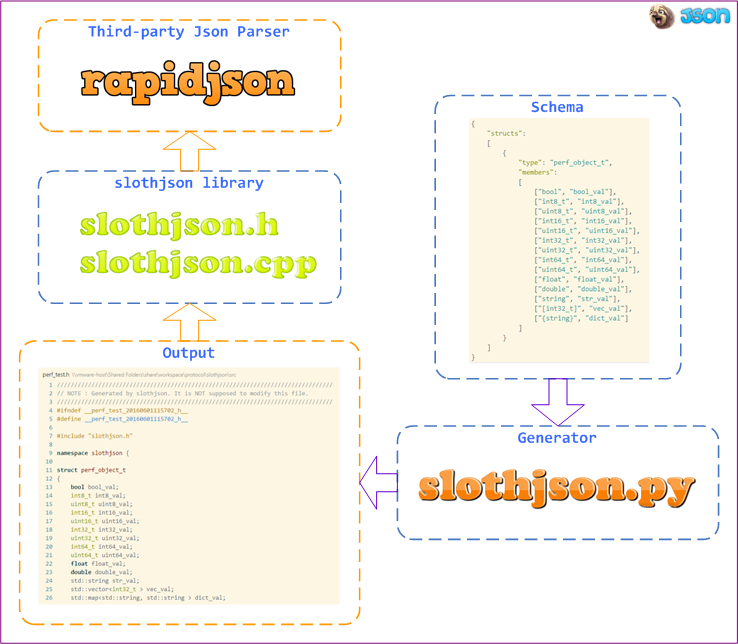

[English](README.md)

# slothjson - 为懒人打造的json对象序列化神器 #

`slothjson` 是基于 [`rapidjson`](https://github.com/miloyip/rapidjson) 之上打造的一款 **全自动化** 的对象序列化神器。  
这玩意儿可以帮助你少写很多代码，少加很多班 ^_^

以下是 `slothjson` 的设计图：

## slothjson是什么？ ##

你是否想要这样一个基础组件，它可以用一行代码完成 **任意类型** 的 `C++` 对象到 `json` 的序列化/反序列化操作？就像这样：

    template <typename T>
    bool encode(const T& obj_val, std::string& json_val);
    
    template <typename T>
    bool decode(const std::string& json_val, T& obj_val);

如果是，恭喜你，`slothjson` 就是为你量身定制的工具。它可以 **解放你的右手（和左手）** ，从此你将不用 **一遍又一遍** 为各种类型的 `C++` 对象编写 `json` 序列化/反序列化 的代码，只需要一个极其简单的数据描述文件，一行命令， **这些代码便可以被瞬间生成出来** ！

因此，
> 
`slothjson` 不是又一个 `rapidjson`；`rapidjson` 已经将 `json` 解析的性能做到了极致，`slothjson` 不需要重复造轮子；  
`slothjson` 做了 `rapidjson` 缺少的东西：**自动化**；  
`rapidjson` 用于解决 **从0到1** 的问题；  
`slothjson` 用于解决 **从1到100** 的问题，也就是 **量产**， **解放生产力** 。

## slothjson有什么？ ##
* 简单、人性化的接口定义（一行代码搞定一切）
* 简单、强大的代码生成器，支持全自动化（不用去手动码序列化的代码）
* 支持可选字段（可选字段编码、可选字段解码，无鸭梨）
* 灵活的数据描述文件（支持数组、字典、嵌套对象，以及**数组、字典的嵌套定义**）
* 设计简洁（没有使用复杂的 `C++` 模板技巧，阅读门槛很低），易复用（比如 `xml`，也可以这样玩），易扩展（支持新的类型极其容易）
* 跨平台（Windows & Linux & OS X）

## slothjson怎么用？ ##

首先，你需要将以下内容放到你的项目中：

* `rapidjson`: 对应 `include/rapidjson`，这个是世界上最快的 `json` 解析库
* `slothjson`: 对应 `include/slothjson.h` 以及 `include/slothjson.cpp`，这两个是 `slothjson` 基础库文件

**以上就是全部的依赖** ，是不是很简单？ ^_^

接下来，你需要用几秒钟了解 `slothjson` 提供的最重要的接口：

	namespace slothjson
	{
        // 将C++对象编码成json字符串
	    template<bool pretty, typename T>
	    bool encode(const T& obj_val, std::string& json_val);

        // 将json字符串解码成C++对象
	    template<typename T>
	    bool decode(const std::string& json_val, T& obj_val);
	}
	
	namespace slothjson
	{
        // 将C++对象编码成json字符串，并保存到文件中
	    template<bool pretty, typename T>
	    bool dump(const T& obj_val, const char * path);

	    // 从文件中读取json字符串，并解码成C++对象
	    template<typename T>
	    bool load(const char * path, T& obj_val);
	};

`pretty` 参数用于控制 `json` 字符串的编码风格。
  
* 当 `pretty` 设置为 `true`，表示以用户友好的方式编码（ **带有缩进和换行** ）；  
* 当 `pretty` 设置为 `false`，将以 **最快** 的方式进行编码（没有缩进和换行）

以上两组接口基本可以满足所有的需求。

**举例** ，编写 `schema` 文件 `fxxx_gfw.json` 如下：

	{
	    "structs": 
	    [
	        {
	            "type": "fxxx_gfw_t",
	            "members": 
	            [
                    ["bool", "bool_val", "true"],
                    ["int8_t", "int8_val", "'a'"],
	                ["int32_t", "int32_val", "-111111"],
	                ["uint64_t", "uint64_val", "0xffff"],
	                ["double", "double_val", "111111.111111"],
	                ["string", "str_val", "test"],
	                ["[int32_t]", "vec_val"],
	                ["{string}", "dict_val"]
	            ]
	        }
	    ]
	}

运行如下命令：

    python generator/slothjson.py -f src/fxxx_gfw.json

生成 `fxxx_gfw.h` 和 `fxxx_gfw.cpp` 之后，将它们添加到你的项目中。  
接下来你可以这样编写 `json` 序列化的代码：

    slothjson::fxxx_gfw_t obj_val;
    // 设置obj_val的内容
    ......
    // 输出为字符串
	std::string json_val;
	bool rc = slothjson::encode <false> (obj_val, json_val);
    // 输出到文件
    std::string path = "fxxx_gfw_t.json";
    bool rc = slothjson::dump <false> (obj_val, path);

如果不想序列化全部字段，可以这样编写：

    obj_val.skip_dict_val(); // 调用 skip_xxx 方法
反序列化的代码类似：

    // 从字符串读取
	std::string json_val;
    // 设置json_val的内容
    ......
    slothjson::fxxx_gfw_t obj_val;
	bool rc = slothjson::decode(json_val, obj_val);

    // 从文件读取
	std::string path = "fxxx_gfw_t.json";
    slothjson::fxxx_gfw_t obj_val;
	bool rc = slothjson::load(path, obj_val);

如果想判断指定的字段是否在 `json` 中，可以这样编写：

    if (obj_val.json_has_dict_val()) // 调用 json_has_xxx 方法
    {
         ......
    }

以上就是 `slothjson` 的用法，很简单吧？  

PS: 如果您是 `linux` 开发者，却告诉我您不会写 `Makefile`，我会鄙视您的 ^_^

## slothjson支持哪些平台？ ##

目前测试通过的平台包括：

Platform | Description
---------|----------------------------------------------------------
Linux    | CentOS 6.x & Ubuntu 10.04 (kernel 2.6.32) GCC 4.4.7
Win32    | Windows 7, MSVC 10.0
OS X     | Mac OS X EI Capitan, GCC 4.2.1, Apple LLVM version 7.3.0

## 进阶 ##
* [工程目录](doc/zh/index.md)
* [设计方法](doc/zh/design.md)
* [数据描述文件](doc/zh/schema.md)
* [FAQ](doc/zh/FAQ.md)

## License ##

`slothjson` is licensed under [New BSD License](https://opensource.org/licenses/BSD-3-Clause), a very flexible license to use.

## 作者 ##

* 程卓 (jobs, yao050421103@163.com)  

## 更多 ##

- Yet Another Schema - [yas](https://github.com/jobs-github/yas)  
- 姊妹篇 - [slothxml](https://github.com/jobs-github/slothxml)  
- 高性能可伸缩的序列化库 - [rawbuf](https://github.com/jobs-github/rawbuf)  
- 高性能分布式存储服务 - [huststore](https://github.com/Qihoo360/huststore)  